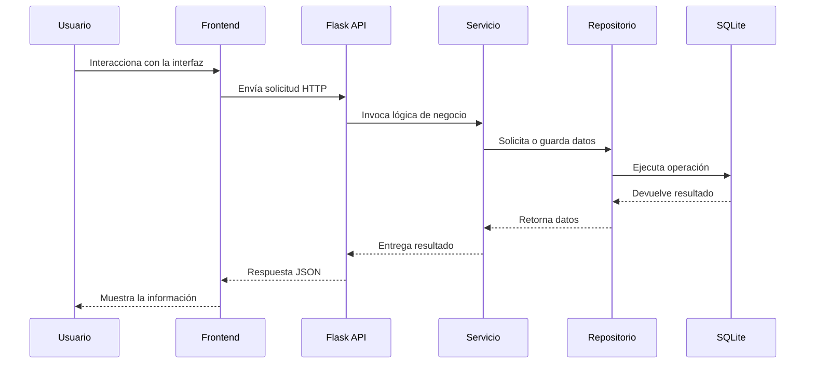

# 02. Arquitectura del Sistema

## 1. Visión general

La aplicación sigue una arquitectura en capas, con separación entre:

- presentación: frontend estático en HTML, CSS y JavaScript
- controladores o rutas: endpoints Flask
- lógica de negocio: servicios
- acceso a datos: repositorios
- almacenamiento: SQLite

## 2. Tecnologías utilizadas

- Python 3.x
- Flask como framework web
- SQLite como motor de base de datos
- Flask session para autenticación por sesión
- HTML, CSS y JavaScript vanilla para el frontend
- pytest para pruebas unitarias e integración

## 3. Estructura del proyecto

```text
libreria/
├── backend/
│   ├── app.py
│   ├── config.py
│   ├── database.py
│   ├── models/
│   ├── repositories/
│   ├── routes/
│   ├── services/
│   └── tests/
├── frontend/
│   ├── index.html
│   ├── css/
│   ├── js/
│   └── pages/
├── docs/
└── requirements.txt
```

## 4. Componentes principales

### 4.1 Frontend
El frontend es estático y consume la API REST del backend por medio de JavaScript.

### 4.2 Backend
El backend expone endpoints REST para:
- autenticación
- libros
- ventas

### 4.3 Servicios
Contienen la lógica de negocio, por ejemplo:
- LibroService
- VentaService

### 4.4 Repositorios
Encapsulan el acceso a la base de datos SQLite.

### 4.5 Modelo de datos
Representa entidades como libro y venta.

## 5. Flujo de una solicitud



## 6. Consideraciones de diseño

- La arquitectura favorece la separación de responsabilidades.
- La lógica de negocio no depende directamente del framework.
- La interfaz es independiente del backend, siempre que los endpoints estén disponibles.
- El sistema está preparado para crecer con nuevas funcionalidades sin reescribir todo el proyecto.
