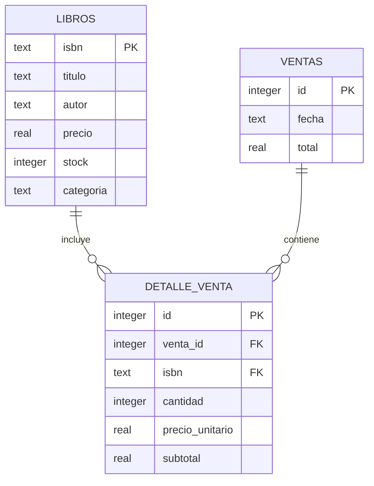

# 03. Base de Datos

## 1. Modelo general

La aplicación utiliza SQLite como base de datos local. La persistencia principal está enfocada en libros y ventas.

## 2. Tablas

### 2.1 Tabla libros
Almacena el catálogo de la librería.

| Campo | Tipo | Restricciones | Descripción |
|---|---|---|---|
| isbn | TEXT | PRIMARY KEY | Identificador único del libro |
| titulo | TEXT | NOT NULL | Título del libro |
| autor | TEXT | NOT NULL | Autor del libro |
| precio | REAL | CHECK (precio >= 0) | Precio del libro |
| stock | INTEGER | CHECK (stock >= 0) | Stock disponible |
| categoria | TEXT | Opcional | Categoría o tipo de libro |

### 2.2 Tabla ventas
Guarda la cabecera de cada venta registrada por el administrador.

| Campo | Tipo | Restricciones | Descripción |
|---|---|---|---|
| id | INTEGER | PRIMARY KEY AUTOINCREMENT | Identificador de la venta |
| fecha | TEXT | NOT NULL | Fecha de registro |
| total | REAL | NOT NULL | Total de la venta |

### 2.3 Tabla detalle_venta
Guarda los ítems incluidos en cada venta.

| Campo | Tipo | Restricciones | Descripción |
|---|---|---|---|
| id | INTEGER | PRIMARY KEY AUTOINCREMENT | Identificador del detalle |
| venta_id | INTEGER | NOT NULL, FOREIGN KEY | Referencia a la venta |
| isbn | TEXT | NOT NULL, FOREIGN KEY | Referencia al libro |
| cantidad | INTEGER | CHECK (cantidad > 0) | Cantidad vendida |
| precio_unitario | REAL | NOT NULL | Precio unitario del libro |
| subtotal | REAL | NOT NULL | Importe del detalle |

## 3. Relaciones

- Una venta tiene muchos detalles de venta.
- Un detalle de venta pertenece a una venta.
- Un detalle de venta referencia a un libro.
- Un libro puede aparecer en varias ventas a través de los detalles.

## 4. Diagrama entidad-relación

## 5. Nota importante sobre usuarios

En la implementación actual, los usuarios no se almacenan en SQLite. La autenticación se maneja mediante sesiones y un diccionario en memoria para los usuarios administrador y clientes registrados.
