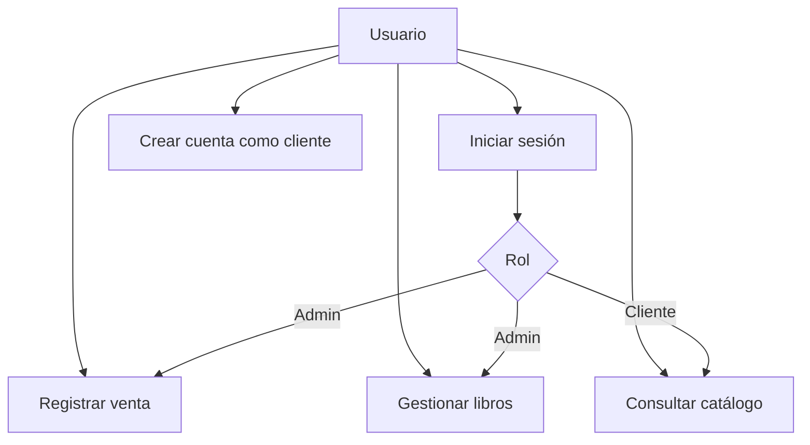
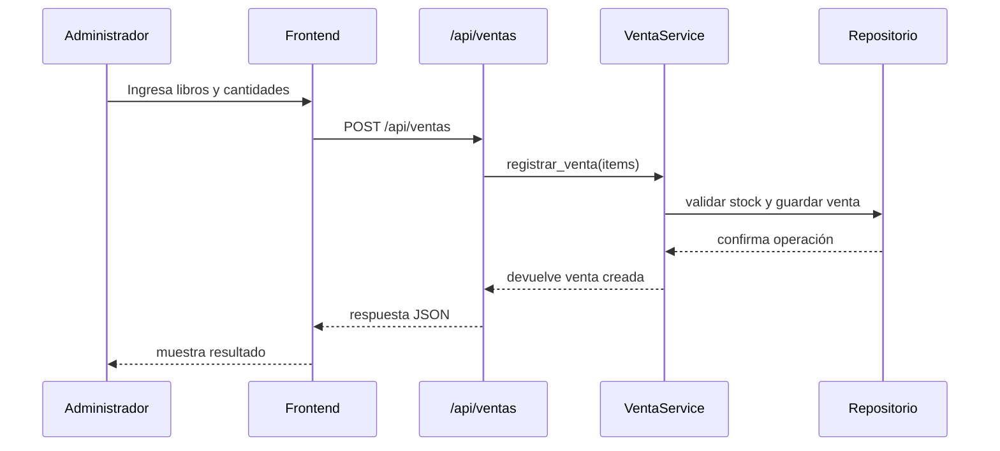

# 04. Diseño del Sistema

## 1. Módulos del sistema

### 1.1 Módulo de autenticación
Responsable del login, registro de clientes, logout y control de sesión.

Funciones principales:
- validar credenciales
- crear cuentas de cliente
- asignar rol de usuario
- proteger rutas de administración

### 1.2 Módulo de libros
Responsable del catálogo y la administración del inventario.

Funciones principales:
- listar libros
- buscar libros
- registrar libros
- actualizar libros
- eliminar libros

### 1.3 Módulo de ventas
Responsable de registrar compras presenciales y actualizar el stock.

Funciones principales:
- registrar una venta
- validar stock disponible
- descontar stock del inventario
- mostrar historial y resumen de ventas

### 1.4 Módulo de frontend
Responsable de la experiencia visual del usuario.

Incluye:
- página de login y registro
- página principal del cliente
- página de administración de libros
- página de ventas para el administrador

## 2. Casos de uso principales

## 3. Diseño de clases principales

- Libro: representa un libro del catálogo.
- Venta: representa una venta registrada.
- DetalleVenta: representa un ítem dentro de una venta.
- LibroRepository: gestiona acceso a datos de libros.
- VentaRepository: gestiona acceso a datos de ventas.
- LibroService: valida reglas del catálogo.
- VentaService: valida reglas de venta y stock.
- Auth routes: exponen endpoints de autenticación.

## 4. Diagrama de interacción de registro de venta

## 5. Decisiones de diseño

- El sistema está pensado para uso simple y local, sin necesidad de un servidor externo complejo.
- El control de acceso se basa en sesiones para evitar que el cliente acceda a funciones del administrador.
- La lógica de negocio se separa del acceso a datos para favorecer el mantenimiento.
